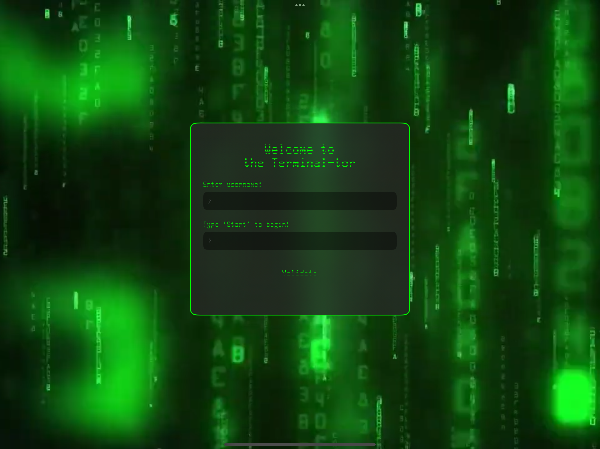
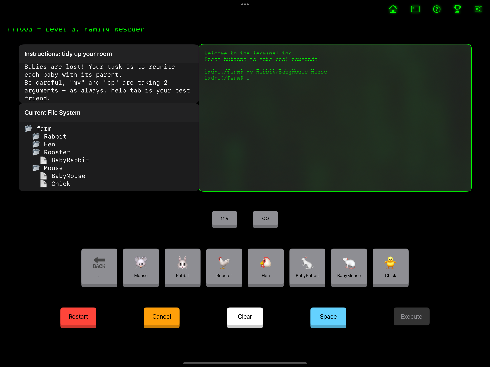
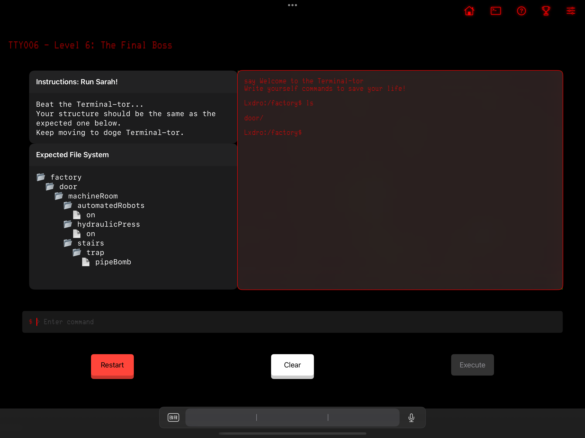

# The Terminal-tor

An educational and immersive way to learn terminal commands, created for the **Swift Student Challenge 2025**. 🎉

## Description

**The Terminal-tor** is a gamified learning experience designed to teach essential terminal commands through interactive levels. Inspired by the *"do it yourself"* philosophy, the app encourages users to experiment, problem-solve, and learn by doing—just like real developers reading documentation to understand new tools.

From guided button-based interactions to full command-line input, the difficulty scales progressively, making it accessible to beginners while still offering a challenge for more experienced users.

## Screenshots









## Run Locally

Copy/Paste this command in a terminal to clone and rename the repository.

```bash
  git clone https://github.com/Lxdro/the_Terminal-tor.git theTerminalTor.swiftpm
```

Now you can open the project with **Swift Playground** or **XCode!**


## Usage

  - Designed for **MacBook** and **iPad** (landscape mode).
  - A **physical keyboard** is highly recommended for the best experience.
  - The *"Enter"* key is used to execute commands.
## What's next?

There’s still so much to improve! Here are some planned features for future versions:
  - iOS compatibility
  - Achievements system
  - Data persistence (track level best scores)
  - Proper settings menu
  - Design refinements
  - More challenging levels
## Feedback

I’d love to hear your feedback! If you have any thoughts, suggestions, or just want to share your experience, feel free to reach out on X *(@Droni0s)*.

I challenge you to send me your best score on the final level. 😈
